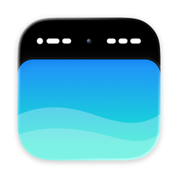

<p align="center"></p>

<h1 align="center">Notched</h1>

<p align="center">Turns your menu bar black, so the MacBook notch disappears into the bezel.<br>
<a href="https://notched.vercel.app"><b>Download for Mac</b></a> · free · macOS 14+ · Apple silicon</p>

Notched saves a copy of your wallpaper with a black strip the height of the menu bar and sets that
copy as your desktop picture. The menu bar turns black, its text turns white, and the notch blends in.

- **Dynamic wallpapers** keep every frame and their time-of-day or light/dark schedule.
- **Every display and Space**: each screen gets a copy at its own resolution, or only the built-in display if you prefer.
- **Rounded corners** under the menu bar, small, medium or large.
- **Watches in the background**: change your wallpaper and the bar is redone within about two seconds.
- **Rotation**: macOS can't shuffle under the black bar, so Notched rotates a folder itself (and takes over a shuffle folder you already set).
- **Undo**: switch it off and your original comes back. Other Spaces get theirs back the next time you visit them.
- Start at login, hide the menu bar icon (open the app again to bring it back), Sparkle updates.

Aerial, colour and other live wallpapers are left alone: there's no still image to edit.

## Privacy

Your original files are never modified; copies live in `~/Library/Application Support/Notched`. The only
network request is a daily update check against `notched.vercel.app`. No analytics, no account.

## Build from source

```bash
xcodegen generate
xcodebuild -project Notched.xcodeproj -scheme Notched -derivedDataPath build build
build/Build/Products/Debug/Notched.app/Contents/MacOS/Notched --selftest      # renderer checks
build/Build/Products/Debug/Notched.app/Contents/MacOS/Notched --snapshot site/assets   # popover PNGs
scripts/release.sh                                                            # maintainer only
```

Needs Xcode 26+ (for `actool` and the Liquid Glass icon) and [XcodeGen](https://github.com/yonaskolb/XcodeGen).
The first build downloads Sparkle 2.10.0 into `Vendor/` (`scripts/fetch-sparkle.sh`, checksum-pinned).
The website is the static `site/` folder.

## How it works

`NSWorkspace` reports each screen's wallpaper and its scaling options. Notched redraws the picture onto a
canvas the size of the screen in pixels, the way macOS would place it (fill, fit, stretch or center), paints
the band and the corner fillets, and writes a HEIC with the same `apple_desktop` schedule. It uses public
APIs only, so each Space is fixed up when you visit it.

---

Independent project. Not affiliated with Apple. MIT licensed.
